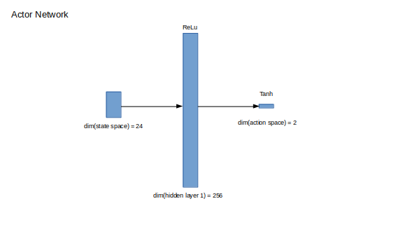
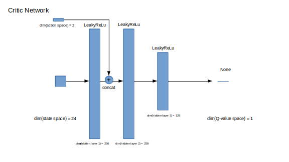
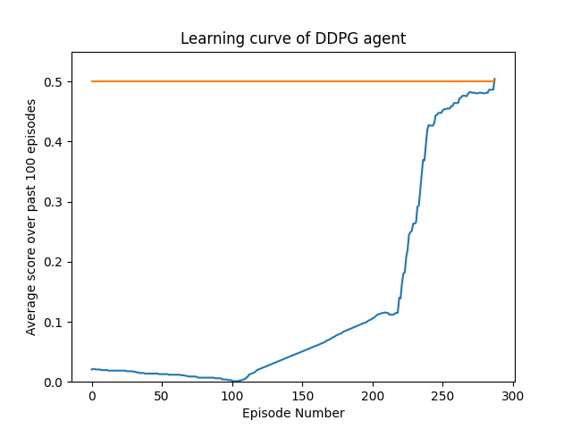

# Udacity Deep Reinforcement Learning Nano Degree
## Collaboration and Competition Project Report

### Learning Algorithm

<!-- The report clearly describes the learning algorithm, along with the chosen hyperparameters. It also describes the model architectures for any neural networks. -->
The tennis environment features two agents who both have a state space of 24 and an action space of 2. To solve the tennis environment we adapted Deep Deterministic Policy Gradient<sup>1</sup> from the Udacity deep-reinforcement-learning repository<sup>2</sup> on GitHub.
#### DDPG
The core of the learning algorithm updates according to the following:

```python
def learn(self, experiences):
    # Get (s,a,r,s') tuples from the replay buffer.
    states, actions, rewards, next_states, dones = experiences

    # Update critic
    # Get predicted next-state actions
    actions_next = self.actor_target(next_states)

    # Compute predicted target for predicted action based on the policy and s'.
    Q_targets_next = self.critic_target(next_states, actions_next)

    # Compute Q targets for current states (y_i)
    Q_targets = rewards + (gamma * Q_targets_next * (1 - dones))

    # Compute critic loss
    Q_expected = self.critic_local(states, actions)

    # TD_error = np.abs(Q_expected - Q_targets) so this is the average of TD_error^2
    critic_loss = F.mse_loss(Q_expected, Q_targets)

    # Minimize the loss
    self.critic_optimizer.zero_grad() # Clear gradient
    critic_loss.backward()            # Backpropagation
    # Clip gradient to stabilize learning and minimize catastrophic forgetting
    torch.nn.utils.clip_grad_norm_(self.critic_local.parameters(), 1)
    self.critic_optimizer.step()      # Update parameters

    # Update actor
    actions_pred = self.actor_local(states)

    # The minus sign is all-important. Without it we'd be finding the worst action to
    # take. We have to do this instead of argmax because of continuous action space.
    actor_loss = -self.critic_local(states, actions_pred).mean()

    # Minimize the loss
    self.actor_optimizer.zero_grad() # Clear gradient
    actor_loss.backward()            # Backpropagation
    # Clip the gradients of the actor_local network.
    torch.nn.utils.clip_grad_norm_(self.actor_local.parameters(), 1)
    self.actor_optimizer.step()      # Update parameters

    # Now we update the target networks
    self.soft_update(self.critic_local, self.critic_target, self.tau)
    self.soft_update(self.actor_local, self.actor_target, self.tau)

```  

DDPG attempts to minimize the TD error in a similar way as DDQN<sup>6</sup>, but with the extra step of minimizing the weights of an actor network with respect to the state-action function Q( _s_, _a_ ) represented by a critic network.

#### Randomized replay buffer initialization
To enable greater exploration of the state space without spending a lot of time messing around with weight decay parameters, after searching through the forum<sup>3</sup> we decided to initialize the replay buffer with 1000 episodes worth of (_s_, _a_, _r_, _s'_ ) experience tuples by doing the following in our main learning loop:


```python
for i_episode in range(num_episodes):
    for t in range(max_t):
        # Oh hey look we're gathering random sample neato go crazy!
        if i_episode < starting_random:
            actions = 2 * np.random.rand(n_agents, agent.action_size) - 1.0
        # Oop better get serious and pay attention this is serious business!
        else:
            for i_agent in range(n_agents):
                # Self-play means different agents, same model. Like this.
                actions[i_agent, :] = agent.act(states[i_agent, :])
        next_states, rewards, dones, _ = step_unity(env, actions, brain_name)
```

#### Self-play
As you can see from the fact we call `agent.act()` for both agents in the simulation using the same PyTorch model, we are exploiting the fact that the tennis environment has been designed for reinforment learning agents which utilize self-play.

#### Parameter Noise
After much consternation and many weaks spent fooling with every configuration possible, up to and including adding a prioritized experience replay buffer<sup>5</sup>, we decided to utilize parameter noise<sup>7</sup> as opposed to action noise to explore the policy space. Our novel implementation of parameter noise went as follows:
1. We created a new model for the noise in `model.py` where we simply inherit the `Actor` class and over-write their `reset_parameters()` method to generate normally distributed noise in the parameter space.
```python
class ActorNoise(Actor):
    """Parameter noise for Actor policy model."""

    def __init__(self, state_size, action_size, seed, cfg):
        # We want a carbon copy of the actor model here.
        super(ActorNoise, self).__init__(state_size, action_size, seed, cfg)

    def reset_parameters(self):
        # One thing different, use normally distributed noise.
        self.fc1.weight.data.normal_(*hidden_init(self.fc1))
        self.fc2.weight.data.normal_(std=self.weight_init_lim)
```
2. We utilized the pattern of `agent.soft_update()` in `ddpg_agent.py` to create a new method `agent.hard_update()` which adds the `actor_local` model to `noise_modulation` times the `actor_noise` model. This effectively gives us a copy of `actor_local` with a bit of noise injected into the parameter space.
```python
def hard_update(self, local_model, noise_model, noise_modulation):
      """theta_noise = theta_local + noise_modulation * theta_noise"""
      for noise_param, local_param in zip(noise_model.parameters(), local_model.parameters()):
          noise_param.data.copy_(local_param.data + noise_modulation * noise_param.data)
```
3. Now we have to update `agent.act()` to add noise in the parameter space instead of just adding noise to the output of the policy in the action space.
```python
def act(self, state, add_noise=True):
      """Returns actions for given state as per current policy."""
      state = torch.from_numpy(state).float().to(device)
      self.actor_local.eval()
      action = self.actor_local(state).cpu().data.numpy()
      if add_noise:
          # action += self.noise_modulation * self.noise.sample()

          # Generate the normally distributed parameter noise.
          self.actor_noise.reset_parameters()
          # This probably isn't necessary but for goodness sake doesn't hurt.
          self.actor_noise.eval()

          # Copy over the contents of actor_local into the noise model.
          # theta_noise = theta_local + noise_modulation * theta_noise
          self.hard_update(self.actor_local, self.actor_noise, self.noise_modulation)

          # Act _with the noise model_
          action = self.actor_noise(state).cpu().data.numpy()
          # We're never going to train this model but whatever
          self.actor_noise.train()
      # Get actor_local ready to have a gradient again.
      self.actor_local.train()
      return np.clip(action, -self.action_clip, self.action_clip)
```

We decided to get the action from the state by evaluating the `actor_noise` model instead of copying noise over into `actor_local` that we would just have to get rid of immediately afterwards. After experimenting with different values we eventually had success with `noise_modulation` set to 0.1.

<!-- To further stabilize training in consensus with the community<sup>3</sup> we added an `UPDATE_EVERY` configuration variable that ensured the algorithm wasn't making too many updates with respect to the influx of new ( _s_, _a_, _r_ ,_s'_ ) tuples according to the following rule:
```python
def step(self, state, action, reward, next_state, done):
    """Save experience in replay memory, and use random sample from buffer
    to learn."""
    self.memory.add(state, action, reward, next_state, done)

    # Learn if enough samples are available in memory AND
    # if n_steps % update_every == 0
    if len(self.memory) > BATCH_SIZE and self.n_steps % self.update_every == 0:
        experiences = self.memory.sample()
        self.learn(experiences, GAMMA)

    self.noise_modulation *= self.noise_decay
    self.n_steps += 1
``` -->

#### Hyperparameters
The hyperparameters we used when successfully training our agent to achieve an average of 0.5 points over 100 episodes are outlined in `config.yaml`, the contents of which are reproduced for clarity below.

```yaml
# Parameters for the Unity Environment
Environment:
  # location of executable
  Filepath: ./Tennis_Linux_NoVis/Tennis.x86_64
  Success: 0.5          # score success cutoff
  # Location of ml-agents python directory.
  Unity_pythonpath: ./ml-agents/python
  Random_seed: 736       # random seed passed to all RNGs involved in code.

# Parameters for the DQN Agent
Agent:
  Buffer_size: 1000000    # replay buffer size
  Batch_size: 128         # minibatch size
  Gamma: 0.99             # discount factor
  Tau: 0.001              # for soft update of target parameters
  Lr_actor: 0.0001        # learning rate for actor
  Lr_critic: 0.0003        # learning rate for critic
  Weight_decay: 0.0       # L2 weight decay for regularization
  Brain_index: 0          # index of agent in environment
  Noise_decay: 1.0       # How much to decay noise modulation during each step.
  Noise_min: -0.2   # The minimum amount of noise we will inject.
  Noise_initial: 0.1  # The starting modulated amplitude of the noise process.
  Update_every: 1    # How many agent.step()s to take before doing a learning step.
  Action_clip: 1.0   # Where to clip actions taken by agent.

# Hyperparameters used during optimization
Training:
  Number_episodes: 10000  # Number of episodes
  Max_timesteps: 3000    # Maximum number of timesteps per episode
  Score_window: 100       # Length of averaging window for agent rewards
  Starting_random: 1000   # Start the training with Starting_random episodes of random sampling
  Self_play: True      # Use self-play or use two learning agents for the environment.
  Persist_mongodb: False
  Dump_agent: 100 # How frequently to dump the agent to disk (saved to db more frequently)
  Pretrained: True # Whether to load pretrained weights
  Actor_fname: ./pretrained_actor.pth # The name of the actor weights
  Critic_fname: ./pretrained_critic.pth # name ofthe critic weights

# Hyperparameters used to define the network architecture
Model:
  fc1_size_actor:   256    # Dimensionality of first fully connected actor layer
  fcs1_size_critic: 256    # Dimensionality of first fully connected critic layer
  fc2_size_critic:  256    # Dimensionality of second fully connected critic layer
  fc3_size_critic:  128    # Dimensionality of third fully connected critic layer
  weight_init_lim:   0.003 # Absolute value of initial weights of output layers

# Hyperparameters which define the noise process
Noise:
  Mu:    0.0            # Mean value of the noise process.
  Theta: 0.15           # weight given to (mu - x) in computation of dx
  Sigma: 0.05           # weight given to normal random number in (-1,1)
```

To create the pretrained weights we were using when we eventually hit the magic
0.5 mark we had the same hyperparameters except for the following:
```yaml
Agent:
  Lr_critic: 0.001
  Noise_min: 0.2   # The minimum amount of noise we will inject.
  Noise_initial: 1.0  # The starting modulated amplitude of the noise process.
Training:
  Starting_random: 300   # Start the training with Starting_random episodes of random sampling
Noise:
  Sigma: 0.2  # weight given to normal random number in (-1,1)
```
which you can find in `config_pretraining.yaml`. Noise was injected into the action space during pre-training phase. We had already trained an agent to reach up to 0.3 averaged over a hundred episodes using only action space noise, but to reach the final goal of 0.5 we used parameter space and the configuration settings in `config.yaml` we gave first.

#### Actor Network
The architecture of the actor network which maps states onto actions is defined by the following graphic:



#### Noise Network
The architecture of the noise network which injects noise into the mapping between states and actions in the parameter space is defined by the following graphic:


#### Critic Network
The architecture of the critic network which maps state and action vectors onto a scalar value is defined by the following graphic:



### Plot of Rewards

<!-- A plot of rewards per episode is included to illustrate that the agent is able to receive an average reward (over 100 episodes) of at least +30. The submission reports the number of episodes needed to solve the environment. -->
Omitting the 1000 steps of randomized replay buffer initialization and pre-training of the initial weights of the successful agent, our agent was able to surpass the 0.5 mark over 100 episodes in only _287 episodes_. What a difference parameter noise made in exploring the problem space to find policies which return large rewards indeed.



### Ideas for Future Work

<!-- The submission has concrete future ideas for improving the agent's performance. -->
<!-- Given the similarity between DDPG and DQN, many of the enhancements to DQN that went into the Rainbow paper<sup>4</sup> are perhaps viable updates. Of particular interest is Prioritized Experience Replay<sup>5</sup>, as the number of episodes required to solve this particular task seemed excessive for the difficulty of the problem. Training more frequently on ( _s_, _a_, _r_ ,_s'_ ) tuples with a high TD error might ameliorate the poor sample efficiency we saw from DDPG in solving this environment. -->

Given the similarity between DDPG and DQN, many of the enhancements to DQN that went into the Rainbow paper<sup>4</sup> are perhaps viable updates. We might try reimplementing the Prioritized Experience Replay<sup>5</sup> now that we're using parameter space noise but even given our random replay buffer initialization and weight pre-training, 287 episodes to solve the environment is very impressive. We are not sure how much better another method would be expected to do.

If the parameter space approach didn't work I would have probably started over from scratch and used A2C<sup>8</sup> as it can use the KL-divergence to stabilize training and prevent catastrophic forgetting. It would also be nice to not have to fiddle with the amplitude of the noise so much by using a stochastic normally distributed policy where `mu` and `sigma` aren't hyperparameters, but values to be estimated during learning.

### References
1. Lillicrap, Timothy P., et al. ‘Continuous Control with Deep Reinforcement Learning’. ArXiv:1509.02971 [Cs, Stat], July 2019. arXiv.org, http://arxiv.org/abs/1509.02971.
2. Udacity, deep-reinforcement-learning, (2019), GitHub repository, https://github.com/udacity/deep-reinforcement-learning
3. Erick G, I cannot get a positive reward in the tennis environment, https://knowledge.udacity.com/questions/101614
4. Hessel, Matteo, et al. ‘Rainbow: Combining Improvements in Deep Reinforcement Learning’. ArXiv:1710.02298 [Cs], Oct. 2017. arXiv.org, http://arxiv.org/abs/1710.02298.
5. Schaul, Tom, et al. ‘Prioritized Experience Replay’. ArXiv:1511.05952 [Cs], Feb. 2016. arXiv.org, http://arxiv.org/abs/1511.05952.
6. van Hasselt, Hado, et al. ‘Deep Reinforcement Learning with Double Q-Learning’. ArXiv:1509.06461 [Cs], Dec. 2015. arXiv.org, http://arxiv.org/abs/1509.06461.
7. Plappert, Matthias, et al. ‘Parameter Space Noise for Exploration’. ArXiv:1706.01905 [Cs, Stat], Jan. 2018. arXiv.org, http://arxiv.org/abs/1706.01905.
8. Mnih, Volodymyr, et al. ‘Asynchronous Methods for Deep Reinforcement Learning’. ArXiv:1602.01783 [Cs], June 2016. arXiv.org, http://arxiv.org/abs/1602.01783.
